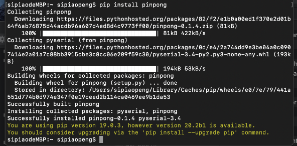
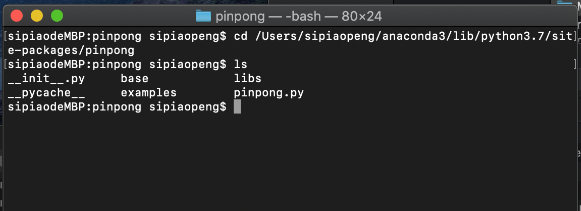
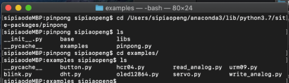

==================
安装pinpong
==================

Windows平台安装
==================

.. glossary::

    Windows

- 1、安装python3，注意安装最后一步勾选add to path，官网下载地址： `点击打开 <https://www.python.org/>`_ 
    .. image::  ../images/addpath.png

- 2、win+R快捷键，输入cmd，
    .. image::  ../images/win_install1.jpg
    小黑窗中输入pip install pinpong即可安装。

    .. image::  ../images/win_install3.jpg

- 3、找到python库文件路径。运行python 3， import os, 可以把python库的路径打印出来。
    .. image::  ../images/win_install4.jpg

    打开任意一个文件夹，将路径复制进去，找到../site-packages/pinpong/examples,可以找到pinpong的示例程序。
    .. image::  ../images/win_install5.jpg

Linux 平台安装
==================

.. glossary::

   Linux 

- 1、终端中输入pip3 install pinpong即可安装。  
- 3、根据本文档类库部分代码编辑python代码  
- 4、连接arudino uno板  
- 5、代码中初始化部分改成uno，COM口使用ls查看  
- 6、代码编写完成直接运行即可  

Mac OS X 平台安装
==================

.. glossary::

    Mac OS X 

   
step 1
启动用命令行，（打开任意finder窗口，键入Shift+Command+U）, 双击“终端”。
输入命令行，安装pinPong库

.. code-block:: bash

        $ pip install pinpong

安装成功后，我们可以到pinpong的目录下，看一下示例代码。

step 2
找到python库的路径，最简单的方式，运行python, import system, 通过print(sys.path)打印出python库的路径。

step 3
更改路径至pinpong的目录下，

.. code-block:: bash

        $ cd /..../python3.7/site-packages/pinpong

step 4
列出目录下的文件，ls,我们可以看到有个examples文件夹，示例代码就在这个文件夹中。

.. code-block:: bash

    
    $ cd example 
    $ ls

版本更新
============

pinpong目前处于快速更新迭代中，因此会不定期进行更新，通过如下命令可以进行版本更新：

.. code-block:: bash

        $ pip install -U pinpong

