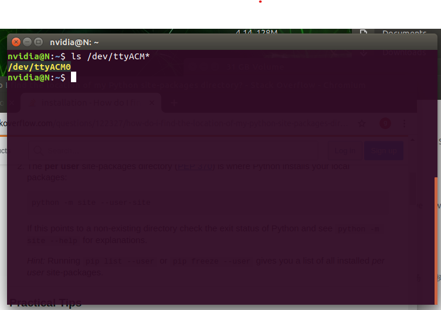

==================
Linux 平台安装
==================

1、终端中输入sudo pip install pinpong即可安装。  

.. code-block:: bash

        $ sudo pip install pinpong

2、找到python库的路径，最简单的方式，运行python3, import pinpong, 通过print(pinpong.__path__)打印出pinpong库的路径。

.. code-block:: python

        import pinpong
        print(pinpong.__path__)

.. image::  images/linux_install4.png

3、更改路径至pinpong的目录下的example中，可以看到示例程序都在这个文件夹。

.. image::  images/linux_install5.png

-------------------
快速开始
-------------------

1、打开终端，Ctrl+Alt+T，并连接上UNO板，在终端中输入，

.. code-block:: bash    
    
        
        $ ls /dev/ttyACM*

2、输入上述命令后，会出现设备的端口号，记录下来

3、找到示例代码，我们已blink.py为例，修改主控板名称为uno和端口号为ttyACM0。修改后保存

4、运行blink.py，uno板开始闪烁，运行成功

.. image::  images/linux_quickstart4.png