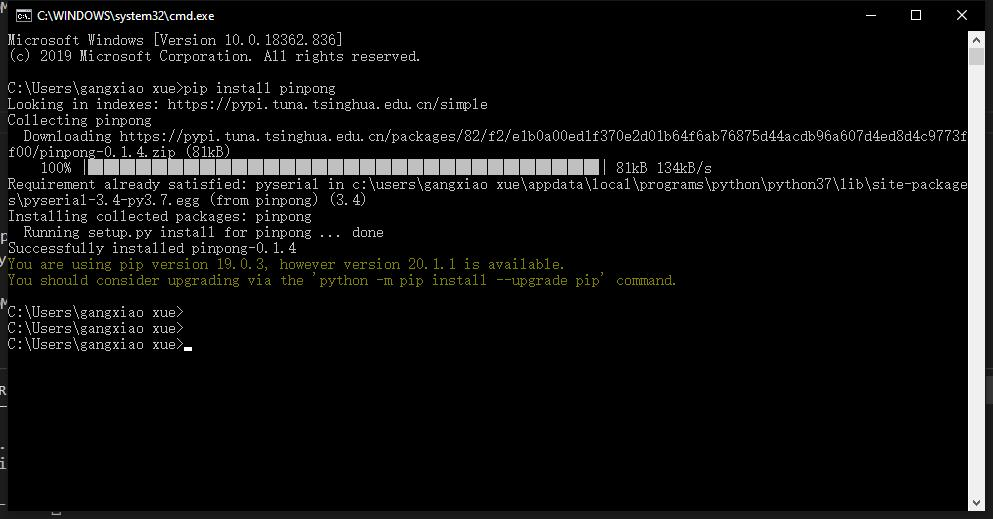
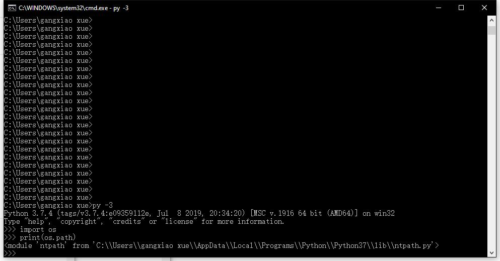

==================
Windows平台安装
==================

1、安装python3, 注意安装最后一步勾选add to path，官网下载地址： `点击打开 <https://www.python.org/>`_ 
    
.. image::  images/addpath.png

2、win+R快捷键，输入cmd

3、小黑窗中输入pip install pinpong即可安装。

4、找到python库文件路径。运行python 3， import os, 可以把python库的路径打印出来。

5、打开任意一个文件夹，将路径复制进去，找到../site-packages/pinpong/examples,可以找到pinpong的示例程序。

.. image::  images/win_install5.jpg

