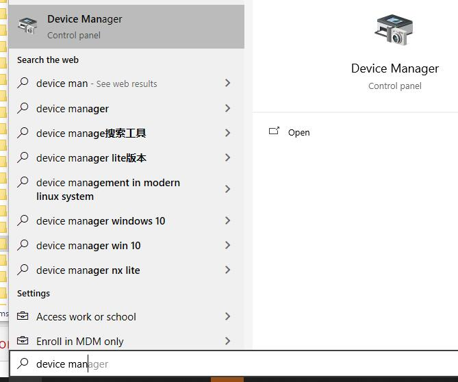
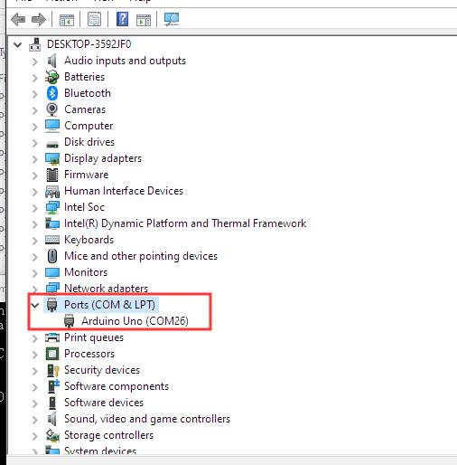

==================
Windows平台安装
==================

1、安装python3, 注意安装最后一步勾选add to path，官网下载地址： `点击打开 <https://www.python.org/>`_ 
    
.. image::  images/addpath.png

2、win+R快捷键，输入cmd

.. image::  images/win_install1.jpg

3、小黑窗中输入pip install pinpong即可安装。

.. image::  images/win_install3.jpg

4、找到python库文件路径。运行python 3， import os, 可以把python库的路径打印出来。

.. image::  images/win_install4.jpg

5、打开任意一个文件夹，将路径复制进去，找到../site-packages/pinpong/examples,可以找到pinpong的示例程序。

.. image::  images/win_install5.jpg

-----------------
快速开始
-----------------

1、 连接arudino uno板,按windows键，在搜索菜单中输入“device manager”, 打开设备管理器（device manager）。

在端口（port）中,可以找到Uno板的端口号，并记录下来。

2、 我们以blink.py为例,用VS Code打开blink.py（或者其他编辑器）。
将board中的参数，leonardo修改为uno，端口号修改为刚刚记录的端口号，com26。修改后保存。    
  
.. image::  images/win_quickstart3.jpg

3、 在小黑窗中，更改路径至pinpong示例，用python3 运行。
Uno板载LED开始闪烁，运行成功。
    
.. image::  images/win_quickstart4.jpg

