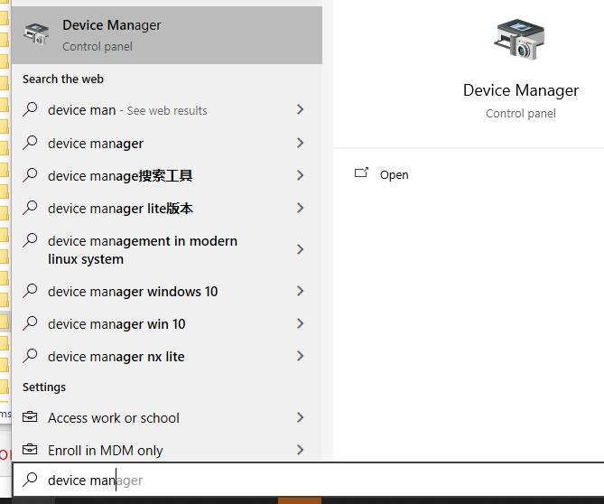
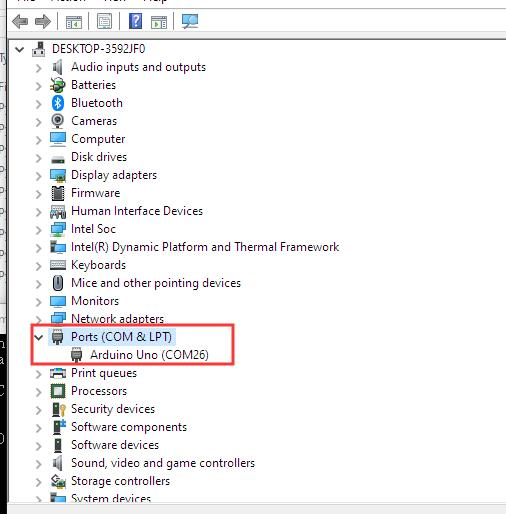
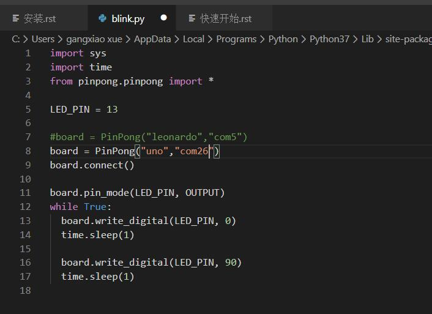
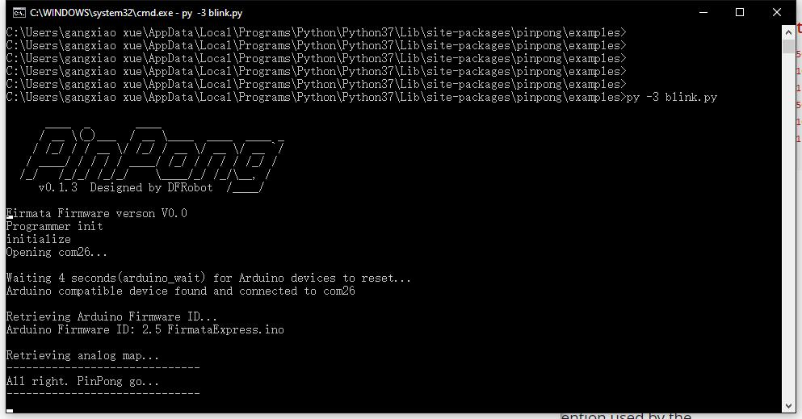

============
Windows平台
============

.. glossary::

    windows

1、 连接arudino uno板,按windows键，在搜索菜单中输入“device manager”, 打开设备管理器（device manager）。

在端口（port）中,可以找到Uno板的端口号，并记录下来。

2、 我们以blink.py为例,用VS Code打开blink.py（或者其他编辑器）。
将board中的参数，leonardo修改为uno，端口号修改为刚刚记录的端口号，com26。修改后保存。    
  

3、 在小黑窗中，更改路径至pinpong示例，用python3 运行。
Uno板载LED开始闪烁，运行成功。
    

